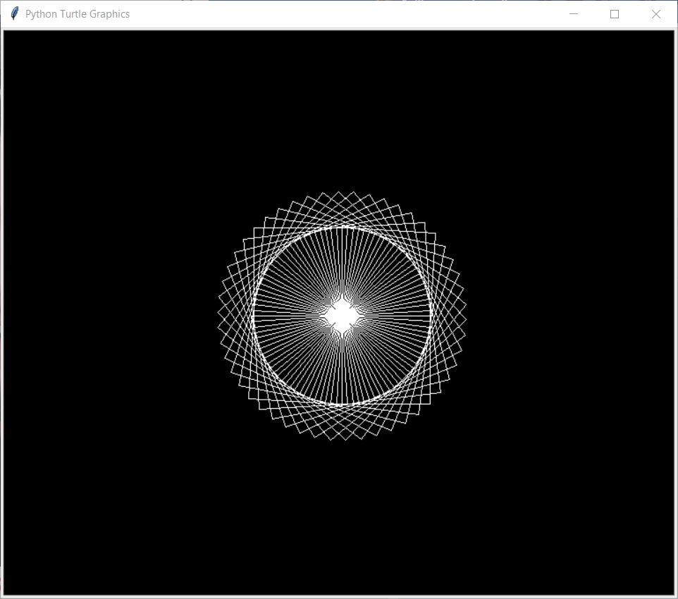
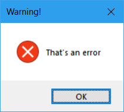

Bibliothèque standard
=====================

Fonctions et types natifs
~~~~~~~~~~~~~~~~~~~~~~~~~

Cette section présente des fonctions et types accessibles dans
l’interpréteur sans rien importer. Ce sont les ``builtins``.

**Plus d’informations et listes exhaustives :**

-  `Fonctions et constructeurs
   natifs <https://docs.python.org/fr/3/library/functions.html>`__

-  `Constantes
   natives <https://docs.python.org/fr/3/library/constants.html>`__

-  `Types natifs ou types
   standard <https://docs.python.org/fr/3/library/stdtypes.html>`__

**Remarque :** Parfois, on est amemnés (même si ce n’est pas forcément
recommandé) à nommer un variable d’après un objet natif. Pour retrouver
ledit objet natif, on peut explicitement passer par le module
``builtins``.

Interactions avec l’utilisateur
^^^^^^^^^^^^^^^^^^^^^^^^^^^^^^^

``print(*objects, sep=' ', end="\n", file=sys.stdout, flush=False)``
    

   Affiche les ``objects`` passés en paramètre sous forme de chaîne de
   caractères grâce au constructeur ``str()``. Si plusieurs objets sont
   passés en paramètre, ils sont séparés par ``sep``. La sortie se
   termine par ``end``. Ces deux derniers paramètres doivent être
   nommés, tous les arguments positionnels sont considérés objets à
   afficher. Si aucun objet n’est fourni, l’affiche que ``end``.

   .. code:: pycon

      >>> print("Python", "OCaml", "C", "Java", sep=" > ")
      Python > OCaml > C > Java

   Afficher revient en fait à écrire dans un flux texte. Par défaut, il
   s’agit de la sortie standard (ce qui s’affiche sur la console). On
   peut changer la cible de la sortie avec le paramètre ``file`` ;
   l’objet passé en paramètre doit avoir une méthode ``write(chaine)``.
   On peut forcer l’effacement du tampon de flux en mettant le paramètre
   ``flush`` à ``True``.

   Pour afficher des progressions, on peut utiliser le retour chariot
   ``"\r"`` comme chaîne finale :

   .. code:: pycon

      >>> import time
      >>> for i in range(100):
      ...     print(f"{i+1} %", end="\r")
      ...     time.sleep(0.1)
      ... else:
      ...     print("\nTerminé !")
      ...
      100%
      Terminé !

``input(prompt="")``
    

   Affiche ``prompt`` et lit une ligne sur l’entrée standard qui est
   convertie en chaîne de caractères (en supprimant le retour à la ligne
   final).

   .. code:: pycon

      >>> print(input("Glou glou ?\n"))
      Glou glou ?
      Ouaf
      Ouaf
      >>> def interactive_add():
      ...     first = int(input("Entrer un premier entier : "))
      ...     second = int(input("Entrer un second entier : "))
      ...     result = first + second
      ...     print(f"{first} + {second} = {result}")
      ...     return result
      ...
      >>> result = interactive_add()
      Entrer un premier entier : 1846
      Entrer un second entier : 898
      1846 + 898 = 2744
      >>> result
      2744

Interactions avec le développeur et débogage
^^^^^^^^^^^^^^^^^^^^^^^^^^^^^^^^^^^^^^^^^^^^

``help([objet])``
    

   Invoque le système d’aide de Python. Si aucun paramètre n’est donné,
   lance l’aide interactive de Python. Le paramètre objet peut être tout
   objet importé ou un mot-clé sous forme de chaîne de caractères.

``breakpoint(*args, **kwargs)``
    

   Sans paramètre, place dans le débogueur. Cette fonction appelle en
   fait ``sys.breakpointhook()``. Il est possible de passer des
   paramètres à cette fonction, cf. `la
   documentation <https://docs.python.org/fr/3/library/sys.html#sys.breakpointhook>`__.

``globals()``
    

   Renvoie un dictionnaire contenant les variables globales du module
   courrant. Si appelé dans une fonction ou une méthode importée,
   renvoie les variables globales du module de provenance.

``locals()``
    

   Renvoie un dictionnaire contenant les variables locales. Si appelé au
   niveau d’un module, a le même comportement que ``globals()``.

``vars([object])``
    

   Renvoie ``objet.__dict__`` si ``objet`` est renseigné, et
   ``locals()`` sinon.

``dir([object])``
    

   Renvoie la liste des variables l’espace de nom courant, et si
   ``object`` est renseigné, tente de renvoyer la liste de ces attributs
   valides.

Types utilitaires pour les boucles
^^^^^^^^^^^^^^^^^^^^^^^^^^^^^^^^^^

``class range``
    

   Les objets ``range`` sont des objets séquentiels (donc itérables)
   dont les éléments sont calculés à la volée. Il s’agit d’un outil
   indispensable pour faire des boucles. Il y a deux manières de
   construire un objet ``range`` :

   ``range(fin)``
      Construit un objet ``range`` qui permet d’itérer sur tous les
      entiers de 0 à ``fin``.

      .. code:: pycon

         >>> for i in range(5):
         ...     print(i)
         ...
         0
         1
         2
         3
         4

   ``range(debut, fin, pas=1)``
      Construit un objet ``range`` permettant d’itérer sur les entiers
      de ``debut`` à ``fin`` avec un pas de ``pas``. Lève une exception
      ``ValueError`` si ``pas`` vaut 0.

      .. code:: pycon

         >>> for i in range(6, -1, -2):
         ...     print(i)
         ...
         6
         4
         2
         0

   Un objet ``range`` n’est pas un itérateur.

   .. code:: pycon

      >>> next(range(1))
      Traceback (most recent call last):
          File "<stdin>", line 1, in <module>
      TypeError: 'range' object is not an iterator

   Il s’agit d’un objet séquentiel itérable qui gère toutes les
   opérations communes sur de tels objets (indices, tranches, etc.). Les
   valeurs sont calculées à la volée grâce à la formule
   ``range_object[i] = debut + pas*i``, avec comme contraintes
   ``i >= 0`` et ``range_object[i] < fin`` si ``pas > 0`` sinon
   ``range_object[i] > fin``.

   Attributs définis :

   ``range.start``
      Valeur du paramètre ``debut`` passé au constructeur (0 par
      défaut).

   ``range.stop``
      Valeur du paramètre ``fin`` passé au constructeur.

   ``range.step``
      Valeur du paramètre ``pas`` passé au constructeur (1 par défaut).

``class zip``
    

   Les objets ``zip`` permettent de construire des objets itérables
   agrégeant d’autres itérables.

   ``zip(*iterables)``
      Construit un objet ``zip`` permettant d’itérer sur l’ensemble des
      itérables passés en paramètres à la fois. Le i-ème élément de cet
      itérateur est un tuple contenant les i-èmes éléments de chaque
      itérable. L’itérateur est épuisé lorsque dès qu’un des itérables
      en paramètre est épuisé.

   .. code:: python3

      >>> for t in zip("python", "java", "cpp", "ocaml"):
      ...     print(*t, sep=", ")
      ...
      p, j, c, o
      y, a, p, c
      t, v, p, a

``class enumerate``
    

   Les objets ``enumerate`` permettent d’itérer et d’énumérer à la fois.

   ``enumerate(iterable, start=0)``
      Construit un objet ``enumerate`` générant des tuples contenant un
      compte (démarrant à ``start``), et les objets résultant de
      l’itération sur l’itérable passé en paramètre.

   .. code:: pycon

      >>> for i, c in enumerate("abc"):
      ...     print(f"{i} : {c}")
      0 : a
      1 : b
      2 : c

   En quelque sorte, ``enumerate(iterable)`` est l’équivalent de
   ``zip(range(len(iterable)), iterable)``.

Manipulation des attributs d’un objet
^^^^^^^^^^^^^^^^^^^^^^^^^^^^^^^^^^^^^

Les fonctions natives suivantes sont utiles pour manipuler dynamiquement
les attributs d’un objet.

``getattr(obj, name[, default])``
    

   Renvoie la valeur de l’attribut nommé ``name`` de l’objet ``obj`` :
   ``getattr(obj, "x")`` renvoie ``obj.x``. Si ``name`` n’est pas pris
   en charge par ``obj`` (c’est-à-dire si ``obj.__getattribute__()`` et
   ``obj.__getattr__()`` ne parviennent pas à calculer ``name``),
   renvoie ``default`` s’il est renseigné, ou lève une exception
   ``AttributeError`` sinon.

``hasattr(obj, name)``
    

   Permet de tester l’existence l’attribut nommé ``name`` par ``obj``
   (``hasattr(obj, "x")`` teste l’existence de ``obj.x``) : renvoie
   ``False`` si ``getattr(obj, name)`` lève une exception
   ``AttributeError``, et ``True`` sinon.

``setattr(obj, name, value)``
    

   Assigne ``value`` à l’attribut nommé ``name`` de ``obj`` :
   ``setattr(obj, "x", 1)`` est équivalent à ``obj.x = 1``.

Ces fonctions sont équivalentes aux syntaxes classiques d’accès aux
attributs et et de leur modificaion (i.e. ``obj.attr``,
``obj.attr = val``), elles ne permettent pas de d’éviter le mécanisme de
descripteur ou les méthodes spéciales ``__getattribute__()``,
``__getattr__()`` ou ``__setattr__()``.

.. code:: pycon

   >>> class Foo:
   ...     @property
   ...     def a(self):
   ...         print("prop access")
   ...         return 1
   ...
   >>> getattr(Foo(), "a")
   prop access
   1
   >>> setattr(Foo(), "a", 2)
   Traceback (most recent call last):
     File "<stdin>", line 1, in <module>
   AttributeError: can't set attribute

Exécuter, évaluer du code
^^^^^^^^^^^^^^^^^^^^^^^^^

``exec(instruction)``
    

   Exécute la chaîne de caractères ``instruction`` en argument.

``eval(expression)``
    

   Évalue la chaîne de caractères ``expression`` en argument et renvoie
   le résultat.

Héritage et typage
^^^^^^^^^^^^^^^^^^

``super(type_obj, obj)``
``isinstance(obj, classinfo)``
``issubclass(obj, classinfo)``

Le père et le créateur
^^^^^^^^^^^^^^^^^^^^^^

``class object``
    

   Classe parente de toutes les classes. Toutes les classes héritent
   implicitement d’\ ``object``.

   ``object()``
      Constructeur de la classe ``object``. Construit un objet vide
      auquel on ne peut assigner d’attribut et qui possède les méthodes
      communes à tous les objets, documentées ci-dessous.

   ``object.__new__(classe)``
      Crée un objet vide. ``object.__new__()`` n’accepte qu’un type
      comme argument, sauf quand ``__init__()`` est définie dans une
      classe, au quel cas ``object.__new__()`` accepte tous les
      arguments de ``__init__()``. Si on veut surcharger
      ``object.__new__()``, il faudra cependant penser à créer l’objet
      vide en appelant ``object.__new__()`` avec la classe comme unique
      paramètre.

   .. code:: pycon

      >>> class ClassWithoutInit:
      ...     pass
      ...
      >>> class ClassWithInit:
      ...     def __init__(self, param):
      ...         self.attr = param
      ...
      >>> class ClassWithNew:
      ...     def __new__(cls, param):
      ...         instance = super().__new__(cls)
      ...         instance.attr = param
      ...         return instance
      ...
      >>> object.__new__(ClassWithOutInit)
      <__main__.ClassWithoutInit object at 0x7f11b9448cc0>
      >>> object.__new__(ClassWithInit, 1)
      <__main__.ClassWithInit object at 0x7f11b933f400>
      >>> object.__new__(ClassWithNew, 1)
      Traceback (most recent call last):
        File "<stdin>", line 1, in <module>
      TypeError: object.__new__() takes exactly one argument (the type to instantiate)

   ``object.__repr__(self)``
      Renvoie une chaîne de caractère indiquant le type de l’objet ainsi
      que son adresse mémoire.

   ``object.__str__(self)``
      Renvoie ``object.__repr__(self)``.

   ``object.__dir__(self)``
      Appelée quand ``dir()`` est appelée sur un objet. Renvoie un
      itérable des attributs de l’objet.

   ``object.__eq__(self, other)``
      Appelée lors de l’opération ``objet == other``. Compare les
      valeurs de hachage et renvoie ``True`` si elles sont égales.

   ``object.__ne__(self, other)``
      Appelée lors de l’opération ``objet != other``. Renvoie l’opposé
      de\ ``object.__eq__(self, other)``.

   ``object.__ge__(self, other)``
      Appelée lors de l’opération ``objet >= other``. Renvoie
      ``NotImplemented``.

   ``object.__gt__(self, other)``
      Appelée lors de l’opération ``objet > other``. Renvoie
      ``NotImplemented``.

   ``object.__le__(self, other)``
      Appelée lors de l’opération ``objet <= other``. Renvoie
      ``NotImplemented``.

   ``object.__lt__(self, other)``
      Appelée lors de l’opération ``objet < other``. Renvoie
      ``NotImplemented``.

   ``object.__getattribute__(self, name)``
      Appelée lorsqu’on accède à l’attribut ``name`` avec la syntaxe
      ``self.name``. Cette méthode va chercher ``name`` dans le
      dictionnaire de l’instance ``self.__dict__``. S’il est
      introuvable, elle va chercher successivement dans le dictionnaire
      du type de l’instance, puis dans toutes les classes parentes. Dans
      le cas où l’attribut est trouvé dans le dictionnaire d’une classe,
      s’il possède une méthode ``__get__()`` (c’est-à-dire s’il s’agit
      d’un descripteur ou par extension d’une propriété), alors celle-ci
      sera appelée.

   ``object.__setattr__(self, name, value)``
      Appelée lorsque l’on écrit ``self.name = value``. Le mécanisme de
      recherche d’attribut est le même que pour
      ``object.__getattribute__()``. Dans le cas d’un descripteur, c’est
      ``__set__()`` qui est appelée.

   ``object.__sizeof__(self)``
      Renvoie la taille occupée en mémoire de ``self`` en octets.

``class type``
    

   Unique métaclasse (créateur de type) native.

   ``type(objet)``
      Passer un objet à ``type`` renvoie la classe qui l’a instancié.

   ``type(name, bases, attrs)``
      Pour créer un type, on appelle le constructeur avec les paramètres
      suivant :

      #. ``name`` : le nom du type à créer;

      #. ``bases``: les classes parentes du type à créer (``object`` est
         implicite) dans un itérable;

      #. ``attrs``: un dictionnaire contenant des attributs à affecter
         au type.

.. _abc:

``abc``, ``collections.abc`` — Classes mères abstraites
~~~~~~~~~~~~~~~~~~~~~~~~~~~~~~~~~~~~~~~~~~~~~~~~~~~~~~~

``re`` — Expressions régulières
~~~~~~~~~~~~~~~~~~~~~~~~~~~~~~~

Le module ``re`` permet d’utiliser les expressions régulières en Python.
**Plus d’informations :** `Documentation Python
3 <https://docs.python.org/fr/3/library/re.html>`__

Écrire une expression régulière
^^^^^^^^^^^^^^^^^^^^^^^^^^^^^^^

Les expressions régulières sont un excellent moyen de retrouver des
motifs complexes dans une chaîne de caractères. On écrit les motifs à
rechercher grâce à plusieurs caractères spéciaux:

Spécification du caractère
    

   -  ``.`` désigne n’importe quel caractère.

   -  ``[]`` permet de dire quels caractères on veut trouver (``[a-e]``
      : ``a``, ``b``, ``c``, ``d`` ou ``e``; ``[a-eA-E]`` idem avec les
      majuscule comprises; ``[+-*]``: soit ``*`` soit ``+`` soit ``-``).

   -  ``\W`` désigne tout caractère non alpha-numérique.

   -  ``\d`` équivaut à ``[0-9]``.

   -  ``\D`` désigne tout caractère non numérique.

   -  ``\w`` équivaut à ``[a-zA-Z0-9_]``.

   -  ``\s`` désigne un espace.

Place du motif dans la chaîne
    

   -  ``^`` (se place au début) signifie que le début de la chaine doit
      correspondre au motif.

   -  ``\$`` (se place à la fin) signifie que la fin de la chaine doit
      correspondre au motif.

Nombre d’apparition(s) consécutive(s)
    

   -  ``{n}`` indique que le caractère précédent doit apparaître ``n``
      fois.

   -  ``{n,m}`` indique que le caractère précédent doit apparaître entre
      ``n`` et ``m`` fois.

   -  ``*`` indique que le caractère précédent n’apparaît pas ou
      apparaît sans maximum d’occurrences (``ab*`` correspond à ``a``,
      ``ab``, ou bien ``abbbbbb``, etc.).

   -  ``+`` indique que le caractère précédent apparaît au moins une
      fois (``ab+`` correspond à ``ab``, ``abb``, ou bien ``abbbbbb``,
      etc.).

   -  ``?`` indique que le caractère précédent apparaît au plus une fois
      (équivalent à ``{0,1}``).

Les quatre derniers qualificateurs sont dits gourmands : ils valident
autant de caractères que possible. Par exemple pour ``"aaaaa"``,
``a{3,5}`` validera la chaîne en entier. Pour une version non gourmande,
on suit le qualificateur d’un ``?`` : ``*?``, ``+?``, ``??`` et
``{n,m}?``. Un qualificateur non gourmand valide le moins de caractères
possibles.

Pour contrôler le nombre d’apparitions d’un groupe de caractères, on met
ceux-ci entre parenthèses (``(abc)+``: ``abc``, ``abcabc``, etc.). Cela
crée un groupe de caractères, on peut le nommer en suivant la
parenthèses ouvrante de ``?P<nom>``. Cela est utile par exemple quand on
veut remplacer des caractères. On peut séparer des expression régulières
par un ``|`` afin d’indiquer que plusieurs possibilités sont possibles.

Méthodes
^^^^^^^^

On compile une expression régulière en utilisant la fonction ``compile``
. Cette fonction retourne un objet expression régulière (un objet
Pattern) sur lequel on peut évaluer diverses méthodes. Si l’on cherche
une phrase, la syntaxe sera:

.. code:: python3

   import re

   regex = re.compile(r"[A-Z]\w*\s?(\w+\s?)*.")

**Remarque :** On utilise le préfixe ``r`` devant la chaîne de caractère
pour éviter d’avoir à écrire ``\\`` au lieu d’un unique ``\``.

On peut rechercher toutes les occurrences du motif grâce à la méthode
``re.finditer(motif, chaine)`` . Cela retourne un objet iterable. On
accède aux objets en appelant ``next(iterable)``, qui retourne un objet
expression rationnelle. Celui-ci contient plusieurs chaînes de
caractères (une pour chaque groupe du motif), on y accède en appelant
les différents groupes : ``objet.group(numéro ou nom)``.

**Exemple :** On veut extraire les phrases d’une chaîne de caractères.

.. code:: pycon

   >>> chaine = r"Je suis une phrase. Moi aussi"
   >>> regex = re.compile(r"[A-Z]\w*\s?(?:\w+\s?)*.")
   >>> resultats = regex.finditer(chaine)
   >>> for phrase in resultats:
   ...     print(phrase.group(0))
   ...
   Je suis une phrase.
   Moi aussi.

On peut remplacer les motifs par d’autres motifs en utilisant la méthode
``re.sub``. Elle prend en paramètres:

#. le motif (chaîne de caractères ou objet expression rationnelle.)

#. le remplacement (peut être une fonction)

#. la chaine à traiter

#. ``count=``\ le nombre d’occurrences à remplacer

et renvoie la chaine de caractères modifiée. Lorsque l’on veut appeler
un groupe de caractères nommé avec ``(?P<nom>)``, on y fait référence
dans la chaine de remplacement par ``\g<nom>``.

.. _datetime:

``datetime`` — Objets dates
~~~~~~~~~~~~~~~~~~~~~~~~~~~

Le module ``datetime`` permet de créer des objets représentant des dates
et de faire des opérations. La classe ``datetime.date`` représente une
date par son année, son mois et son jour:
``jour = datetime.date(2017, 1, 1)`` correspond à la date 1 janvier
2017. La classe ``datetime.timedelta`` permet de faire des opérations
sur les dates. Ses objets sont représentés par un nombre de jours (on
peut construire un ``timedelta`` avec des semaines/mois/années, le
constructeur convertit en jours). Le module ``datetime`` peut ausi être
utilisé pour utiliser des durées plus réduites, i.e. secondes, minutes,
heures, etc.

**Exemple :**

.. code:: pycon

   >>> import datetime
   >>> j1 = datetime.date(2017, 1, 1)
   >>> j2 = j1 + datetime.timedelta(30)
   >>> j2
   datetime.date(2017, 1, 31)

**Documentation :** `Documentation Python
3 <https://docs.python.org/fr/3/library/datetime.html>`__

``functools`` — Outils pour la programmation fonctionnelle
~~~~~~~~~~~~~~~~~~~~~~~~~~~~~~~~~~~~~~~~~~~~~~~~~~~~~~~~~~

Ce module fournit des outils pour la manipulation de fonctions

Préservation des attributs d’une fonction décorée
^^^^^^^^^^^^^^^^^^^^^^^^^^^^^^^^^^^^^^^^^^^^^^^^^

Décorer une fonction change ses attributs (en effet, on retourne un
wrapper en général): en particulier son nom et sa docstring:

.. code:: pycon

   >>> def f():
   ...     return "Hello!"
   ...
   >>> f()
   "Hello!"
   >>> f
   <function f at 0x0000023CECFFC1E0>
   >>> def deco(f):
   ...     def wrapper():
   ...         print(f())
   ...         print("Done.")
   ...     return wrapper
   ...
   >>> @deco
   ... def f():
   ...     return "Hello!"
   ...
   >>> f()
   Hello!
   Done.
   >>> f
   <function deco.<locals>.wrapper at 0x0000023CEDB2EF28>

Le décorateur ``@wraps`` du module ``functools`` permet d’y remédier.

.. code:: pycon

   >>> from functools import wraps
   >>> def deco(f):
   ...     @wraps(f)
   ...     def wrapper(*args, **kwargs):
   ...         print(f())
   ...         print("Done.")
   ...     return wrapper
   ...
   >>> @deco
   ... def f():
   ...     return "Hello!"
   ...
   >>> f()
   Hello!
   Done.
   >>> f
   <function f at 0x00000223E312DEA0>

``turtle`` — Dessins basiques
~~~~~~~~~~~~~~~~~~~~~~~~~~~~~

Contient des classes pour dessiner des formes simples en faisant avancer
des tortues. Elles peuvent avancer, reculer, tourner d’un certain angle.
La classe ``Turtle`` permet de créer des objets tortues qui peuvent :

#. Avancer: ``Turtle.forward(<nb de pixels>)``

#. Reculer: ``Turtle.backward(<nb de pixels>)``

#. Tourner à droite ou à gauche (ex: ``Turtle.right(<degrés>)``)

#. Changer de couleur (``Turtle.color(<couleur>)``) ou de forme
   (``Turtle.shape(<forme>)``).

**Exemple :**

.. code:: python3

   import turtle

   Terrain = turtle.Screen()
   Terrain.bgcolor("black")

   Tortue = turtle.Turtle()
   Tortue.speed(3)
   Tortue.shape("turtle")
   Tortue.color("white")

   for i in range(50):
       for e in range(4):
           Tortue.forward(100)
           Tortue.right(90)
       Tortue.right(360/50)

   Terrain.exitonclick()

   Résultat

**Plus d’informations :** `Documentation Python
3 <https://docs.python.org/fr/3.6/library/turtle.html#methods-specific-to-screen-not-inherited-from-turtlescreen>`__,
`Wikilivres <https://fr.wikibooks.org/wiki/Programmation_Python/Turtle>`__

``ctypes`` — Appeler des fonctions en C
~~~~~~~~~~~~~~~~~~~~~~~~~~~~~~~~~~~~~~~

Ce module sert à appeler des fonctions écrites en langage C dans des
librairies DLL par exemple.

Boites de dialogue
^^^^^^^^^^^^^^^^^^

Le module ctypes peut servir à faire apparaître des boites de dialogue.
On peut modifier le comportement du script Python en fonction du bouton
appuyé car la fonction faisant apparaître ces boites renvoie un entier
qui dépend du bouton appuyé. Diverses options sont disponibles :

.. code:: python3

   # Boutons disponibles :
   # 0 : OK
   # 1 : OK | Annuler
   # 2 : Abandonner | Recommencer | Ignorer
   # 3 : Oui | Non | Annuler
   # 4 : Oui | Non
   # 5 : Recommencer | Annuler
   # 6 : Annuler | Recommencer | Continuer

   # Icone
   # 16 Icone erreur
   # 32 Icone question
   # 48 Icone attention
   # 64 Icone information

**Exemple :**

.. code:: python3

   ctypes.windll.user32.MessageBoxW(0, "That's an error", "Warning!", 16)

   Résultat

``keyboard`` — Manipulation du clavier
~~~~~~~~~~~~~~~~~~~~~~~~~~~~~~~~~~~~~~

``os`` — Diverses interfaces avec le système d’exploitation
~~~~~~~~~~~~~~~~~~~~~~~~~~~~~~~~~~~~~~~~~~~~~~~~~~~~~~~~~~~

``sys`` — Fonctions et paramètres spécifiques au système
~~~~~~~~~~~~~~~~~~~~~~~~~~~~~~~~~~~~~~~~~~~~~~~~~~~~~~~~

``threading`` — Parallélisme avec les threads
~~~~~~~~~~~~~~~~~~~~~~~~~~~~~~~~~~~~~~~~~~~~~

``asyncio`` — Programmation asynchrone
~~~~~~~~~~~~~~~~~~~~~~~~~~~~~~~~~~~~~~

**Nota Bene :** Pour l’instant, cette section sort un peu de nulle part,
mais tout s’éclaircira quand la syntaxe des ``async`` et ``await`` sera
expliquée.

Cette bibliothèque permet de facilement effectuer de la programmation
asynchrone (à ne pas confondre avec la programmation en parallèle).
L’intérêt est de rendre les tâches non-bloquantes, typiquement les
requêtes à des serveurs qui peuvent mettre du temps à obtenir une
réponse. Cette librairie n’est pas adaptée pour les calculs longs, car
elle ne permet pas de calculer plus rapidement !

**Exemple** Voici un code synchrone que l’on peut rendre asynchrone.

.. code:: python3

   import time

   def sync_get_response(id, temps_de_reponse):
       time.sleep(temps_de_reponse/1000)  # simulation temps de reponse
       print("Réponse {} reçue !".format(id))

   def sync_main():
       sync_get_response(1, 50)
       sync_get_response(2, 50)
       sync_get_response(3, 4000)
       sync_get_response(4, 50)
       sync_get_response(5, 50)
       sync_get_response(6, 6000)
       sync_get_response(7, 50)
       sync_get_response(8, 50)
       sync_get_response(9, 50)

   beginning = time.time()
   sync_main()
   print('Durée', time.time()-beginning)

.. code:: pycon

   Réponse 1 reçue !
   Réponse 2 reçue !
   Réponse 3 reçue !
   Réponse 4 reçue !
   Réponse 5 reçue !
   Réponse 6 reçue !
   Réponse 7 reçue !
   Réponse 8 reçue !
   Réponse 9 reçue !
   Durée 10.367376565933228

On remarque que les requêtes longues ralentissent l’exécution du
programme. De plus, les requêtes sont effectuées dans l’ordre.

.. code:: python3

   import asyncio
   import time

   async def get_response(id, temps_de_reponse)
       await asyncio.sleep(temps_de_reponse/1000)
       print("Réponse {} reçue !".format(id))

   async def main():
       req1 = loop.create_task(get_response(1, 50))
       req2 = loop.create_task(get_response(2, 50))
       req3 = loop.create_task(get_response(3, 1000)) # simulons une requete longue
       req4 = loop.create_task(get_response(4, 50))
       req5 = loop.create_task(get_response(5, 50))
       req6 = loop.create_task(get_response(6, 1000)) # une autre
       req7 = loop.create_task(get_response(7, 50))
       req8 = loop.create_task(get_response(8, 50))
       req9 = loop.create_task(get_response(9, 50))
       await asyncio.wait([req1, req2, req3, req4, req5, req6, req7, req8, req9])

   if __name__ == '__main__':
       beginning = time.time()
       try:
           loop = asyncio.get_event_loop()
           loop.run_until_complete(main())
       except:
           pass
       finally:
           loop.close()
           print('Durée', time.time()-beginning)

.. code:: pycon

   Réponse 1 reçue !
   Réponse 7 reçue !
   Réponse 9 reçue !
   Réponse 8 reçue !
   Réponse 2 reçue !
   Réponse 5 reçue !
   Réponse 4 reçue !
   Réponse 3 reçue !
   Réponse 6 reçue !
   Durée 5.994143724441528
   # asyncio.sleep() resquillerait-il ? On lui a pourtant demandé de dormir 6 secondes !

Dans le 2e exemple, le programme n’attend pas de recevoir la réponse
pour envoyer les autres requêtes.

Modules à télécharger
=====================

.. _virtualenv:

``virtualenv`` — Environnements virtuels
~~~~~~~~~~~~~~~~~~~~~~~~~~~~~~~~~~~~~~~~

Les environnement virtuels sont un bon moyen pour:

#. Installer des modules sans avoir besoin des droits administrateurs

#. Avoir plusieurs environnements de travail avec des modules Python de
   versions différentes. Exemple, j’ai un projet Django 2 et je veux
   créer un site avec Django-CMS, qui requiert Django 1! Je suis obligé
   de recourir aux environnements virtuels.

Pour une utilisation basique, on commence par installer ``virtualenv``
avec ``pip``.

.. code:: bash

   $ pip install virtualenv # ou pip3 selon votre version de Python

Puis on se place dans le dossier où l’on veut placer les environnements
virtuels, par exemple sous Linux dans ``/home/votre_nom/python_env/``,
et on crée notre environnement!

.. code:: bash

   $ virtualenv env

Python y place alors les exécutables fondamentaux et quelques modules
basiques. Ensuite, pour travailler dans l’environnement créé, il faut
lancer la commande:

.. code:: bash

   $ source /home/votre_nom/python_env/env/bin/activate

L’environnement apparaît maintenant entre parenthèses dans la console.
Pour désactiver cet environnement, on lance simplement la commande:

.. code:: bash

   (env) $ deactivate

Il existe le module ``virtualenvwrapper`` qui permet de naviguer
facilement entre les environnements. Après avoir installé ce paquet, il
faut ajouter dans le path une variable ``WORKON_HOME`` qui correspond au
répertoire où seront stockés les environnement virtuels. Ensuite on
pourra utiliser les commandes

.. code:: bash

   $ mkvirtualenv env # creation d'un environnement virtuel
   $ workon # visualisation des environnements existants
   env
   (env) $ workon env # selection d'un environnement
   (env) $ deactivate # quitter cet environnement

**Plus d’informations :** `Documentation de
virtualenv <https://virtualenv.pypa.io/en/stable/>`__, `informations
supplémentaires <http://sametmax.com/les-environnement-virtuels-python-virtualenv-et-virtualenvwrapper/>`__

Flask — Microframework Web
~~~~~~~~~~~~~~~~~~~~~~~~~~

Ce framework minimaliste permet de faire des sites Web sans pour autant
imposer une façon de développer.

Plugins utiles:

SQLAlchemy
   un ORM pour gérer plus facilement la bdd

Marsmallow
   un serializer pour Python

``django`` — Framework Web Full Stack
~~~~~~~~~~~~~~~~~~~~~~~~~~~~~~~~~~~~~

Ce module permet de créer des sites web en Python. *Il est question ici
de la version 2*. **Plus d’informations :** `Documentation officielle de
Django 2.2 <https://docs.djangoproject.com/fr/2.2/>`__ `Tutoriel de la
documentation <https://docs.djangoproject.com/fr/2.2/intro/>`__

Django fonctionne selon l’architecture Model-View-Template (MVT) que
l’on peut traduire par Modèle-Vue-Gabarit. Celle-ci s’appuie sur
l’architecture Model-View-Controler (MVC):

-  Les modèles structurent de la base de données, là où sont stockées
   toutes les informations. Ici, ce sont des classes Python dont les
   attributs correspondent à des champs dans la base de données. On
   n’écrit jamais de SQL avec Django!

-  Les vues représentent les pages web: elles présentent les
   informations aux utilisateurs et récupèrent leurs actions. Ici, ce
   sont des fonctions Python qui prennent en argument la requête (HTTP
   par exemple) et des informations sur l’URL et qui renvoie, en
   utilisant les gabarits, la bonne page à l’utilisateur (la bonne
   réponse HTTP).

-  Les gabarits permettent de structurer facilement les vues. Ce sont
   des fichiers HTML avec un peu de syntaxe de gabarit Django.

-  Le contrôleur fait l’interface entre les vues et les modèles: il
   récupère et renvoie les informations nécessaires. Cette partie est
   gérée de manière autonome par Django.

WSGI
~~~~

Ce module permet de faire tourner Python sur un serveur comme Apache. On
voit ici comment déployer une application Flask ou Django avec Apache
2.4 sur un système d’exploitation Debian 9 (Stretch). On considère
qu’Apache est connu. Premièrement, installer le module d’Apache pour
Python 3:

.. code:: bash

   $ sudo apt install libapache2-mod-wsgi-py3

Déploiement de Flask
^^^^^^^^^^^^^^^^^^^^

Hôte virtuel
''''''''''''

Notre application respecte l’arborescence:

.. code:: bash

   app/
   |---flaskapp.wsgi
   |---FlaskApp/
       |---__init__.py
       ...

On crée un hôte virtuel pour notre application Flask.

.. code:: bash

   $ cd /etc/apache2/sites-availables

.. code:: text

   <VirtualHost *:80>
       ServerName domain.com
       ServerAdmin youremail@email.com
       WSGIScriptAlias / /var/www/chemin/votre/app/flaskapp.wsgi

       <Directory /var/www/chemin/votre/app/FlaskApp>
           Require all granted # signifie que toute requête est acceptée
       </Directory>

       ErrorLog ${APACHE_LOG_DIR}/FlaskApp-error.log
       LogLevel warn
       CustomLog ${APACHE_LOG_DIR}/FlaskApp-access.log combined
   </VirtualHost>

On peut prendre n’importe quel nom pour les logs.

Voici le contenu de notre fichier WSGI :

.. code:: python3

   #!/usr/bin/python
   # on dit à Debian d'utiliser python3

   import sys
   import logging

   logging.basicConfig(stream=sys.stderr)
   sys.path.insert(0,"/var/www/chemin/votre/app/")

   # en assumant que l'on a app=Flask(__name__)
   from FlaskApp import app as application

Voilà! Normalemnt ça marche :) À tester avec un Hello World.

``win10toast`` — Notifications Windows 10
~~~~~~~~~~~~~~~~~~~~~~~~~~~~~~~~~~~~~~~~~

``pytaglib`` — Tags de fichiers audio
~~~~~~~~~~~~~~~~~~~~~~~~~~~~~~~~~~~~~

Ce module premet l’accès et l’écriture aux métadonnées (tags) de
fichiers audio. Ce module utilise ``taglib``.

Installation
^^^^^^^^^^^^

Il faut au préalable posséder le paquet de développement de Python,
``python3-devel`` sur Fedora et le paquet de développement de taglib,
``taglib-devel`` sur Fedora. (Pour Debian, il suffit de remplacer
``devel`` par ``dev``.)

Utilisation
^^^^^^^^^^^

.. code:: pycon

   >>> import taglib
   >>> song = taglib.File("chemin/vers/le/fichier.mp3")
   >>> song.tags
   {'ARTIST': ['Foo'], 'TITLE': ['Bar']}
   >>> song.length # durée en secondes
   60
   >>> song.tags["ARTIST"] = ["Baz"] # toujours sous forme de liste
   >>> del song.tags["TITLE"]
   >>> song.save()
   >>> song.tags
   {'ARTIST': ['Baz']}

Principaux tags:

-  ``TITLE``: Titre du morceau

-  ``ARTIST``: Artsite du morceau

-  ``ALBUM``: Album

-  ``COMPOSER``: Compositeur (utilse pour la musique classique)

-  ``TRACKNUMBER``: Numéro de piste

-  ``DATE``: Année de sortie

``autopy`` — Tâches automatiques
~~~~~~~~~~~~~~~~~~~~~~~~~~~~~~~~

